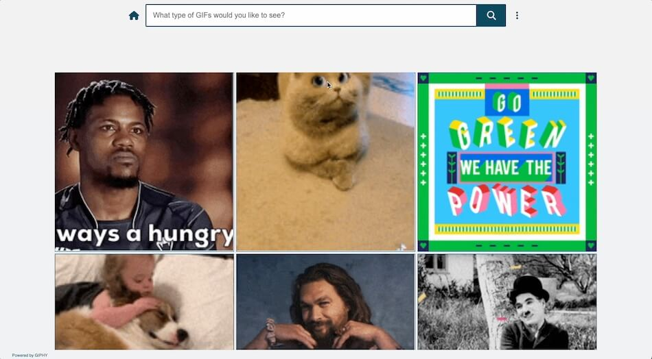

# GIF Search

This is an app built in React that allows users to search the Giphy database.

## Demo

Click image to try for yourself

## Built with

React, CSS3, Giphy API, Font Awesome icons, local storage 

## Features

* The top trending GIFs on Giphy are displayed by default
* The user can search for specific types of GIFs by entering a search query
* The user's search query remains in the input field as a header (like YouTube)
* Search queries can be cleared by clicking the X icon that appears when the input field is not empty
* The button for submitting a query is only active (and focusable) when the input field contains text
* Trending GIFs can be navigated back to by clicking the house icon to the left of the input bar
* GIFs are arranged in a 3-column grid if space allows; if not, they are arranged in 1 or 2 columns
* The app is fully responsive and should work on any screen size
* To the right of the input field is an ellipsis icon; clicking it opens a dialog of settings
* Users can toggle between the following settings:
    * Lazy loading or immediate loading
    * High or low resolution
    * Playing each GIF either only on hover or whenever it is at least partially on screen
    * Infinite scroll or pagination (pagination makes use of custom-built animated buttons)
    * Light or dark mode
* Settings persist in the user's browser with the help of local storage
* For better performance, off-screen GIFs never play, regardless of user settings
* While queried GIFs are loading, a spinner is rendered
* If the query is unsuccessful, an error message and button for refreshing are rendered
* When all relevant GIFs have been displayed, a message and button for refreshing are rendered
